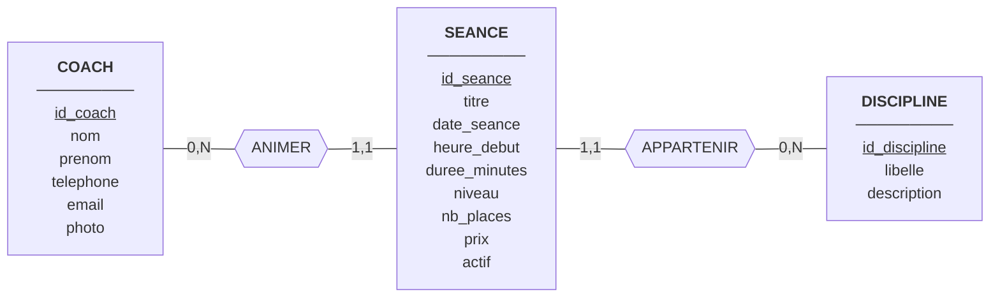

# Modèle Conceptuel de Données (MCD)

## 5. Schéma conceptuel

```mermaid
flowchart LR
    COACH["<b>COACH</b><br/>─────────<br/><u>id_coach</u><br/>nom<br/>prenom<br/>telephone<br/>email<br/>photo"]
    ANIMER{{"ANIMER"}}
    SEANCE["<b>SEANCE</b><br/>─────────<br/><u>id_seance</u><br/>titre<br/>date_seance<br/>heure_debut<br/>duree_minutes<br/>niveau<br/>nb_places<br/>prix<br/>actif"]
    APPARTENIR{{"APPARTENIR"}}
    DISCIPLINE["<b>DISCIPLINE</b><br/>─────────<br/><u>id_discipline</u><br/>libelle<br/>description"]

    COACH ---|"0,N"| ANIMER
    ANIMER ---|"1,1"| SEANCE
    SEANCE ---|"1,1"| APPARTENIR
    APPARTENIR ---|"0,N"| DISCIPLINE
```

*Figure 1 : MCD du système de gestion d'une salle de sport (les identifiants sont soulignés).*
