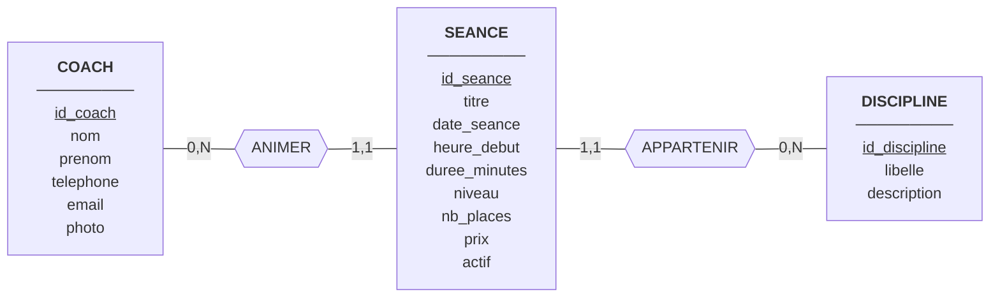

# Modèle Conceptuel de Données (MCD)

## 1. Objectif

Le MCD décrit, indépendamment de toute contrainte technique, les **entités** du système, leurs **propriétés** et les **associations** qui les lient, selon le formalisme Merise.

## 2. Entités

| Entité | Identifiant | Propriétés |
|---|---|---|
| COACH | id_coach | nom, prenom, telephone, email, photo |
| DISCIPLINE | id_discipline | libelle, description |
| SEANCE | id_seance | titre, date_seance, heure_debut, duree_minutes, niveau, nb_places, prix, actif |

## 3. Associations

| Association | Entités liées | Signification |
|---|---|---|
| ANIMER | COACH, SEANCE | Un coach anime des séances |
| APPARTENIR | SEANCE, DISCIPLINE | Une séance relève d'une discipline |

## 4. Cardinalités

| Association | Entité | Cardinalité | Justification |
|---|---|---|---|
| ANIMER | COACH | 0,N | Un coach anime de zéro à plusieurs séances (RG1) |
| ANIMER | SEANCE | 1,1 | Une séance est animée par exactement un coach (RG2) |
| APPARTENIR | SEANCE | 1,1 | Une séance appartient à exactement une discipline (RG4) |
| APPARTENIR | DISCIPLINE | 0,N | Une discipline regroupe de zéro à plusieurs séances (RG3) |

## 5. Schéma conceptuel

*Figure 1 : MCD du système de gestion d'une salle de sport (les identifiants sont soulignés).*

## 6. Lecture du schéma

- Un coach anime **de 0 à N** séances ; une séance est animée par **1 et 1 seul** coach.
- Une discipline regroupe **de 0 à N** séances ; une séance relève de **1 et 1 seule** discipline.

---

Document précédent : [Règles de gestion](01-regles-de-gestion.md) | Document suivant : [MLD](03-mld.md)
