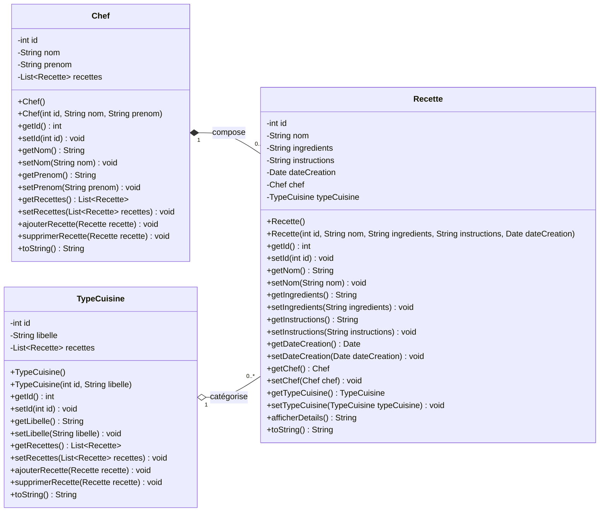

```mermaid
classDiagram
    direction LR

    class Chef {
        -int id
        -String nom
        -String prenom
        -List~Recette~ recettes
        +Chef()
        +Chef(int id, String nom, String prenom)
        +getId() int
        +setId(int id) void
        +getNom() String
        +setNom(String nom) void
        +getPrenom() String
        +setPrenom(String prenom) void
        +getRecettes() List~Recette~
        +setRecettes(List~Recette~ recettes) void
        +ajouterRecette(Recette recette) void
        +supprimerRecette(Recette recette) void
        +toString() String
    }

    class TypeCuisine {
        -int id
        -String libelle
        -List~Recette~ recettes
        +TypeCuisine()
        +TypeCuisine(int id, String libelle)
        +getId() int
        +setId(int id) void
        +getLibelle() String
        +setLibelle(String libelle) void
        +getRecettes() List~Recette~
        +setRecettes(List~Recette~ recettes) void
        +ajouterRecette(Recette recette) void
        +supprimerRecette(Recette recette) void
        +toString() String
    }

    class Recette {
        -int id
        -String nom
        -String ingredients
        -String instructions
        -Date dateCreation
        -Chef chef
        -TypeCuisine typeCuisine
        +Recette()
        +Recette(int id, String nom, String ingredients, String instructions, Date dateCreation)
        +getId() int
        +setId(int id) void
        +getNom() String
        +setNom(String nom) void
        +getIngredients() String
        +setIngredients(String ingredients) void
        +getInstructions() String
        +setInstructions(String instructions) void
        +getDateCreation() Date
        +setDateCreation(Date dateCreation) void
        +getChef() Chef
        +setChef(Chef chef) void
        +getTypeCuisine() TypeCuisine
        +setTypeCuisine(TypeCuisine typeCuisine) void
        +afficherDetails() String
        +toString() String
    }

    Chef "1" *-- "0..*" Recette : compose
    TypeCuisine "1" o-- "0..*" Recette : catégorise
```