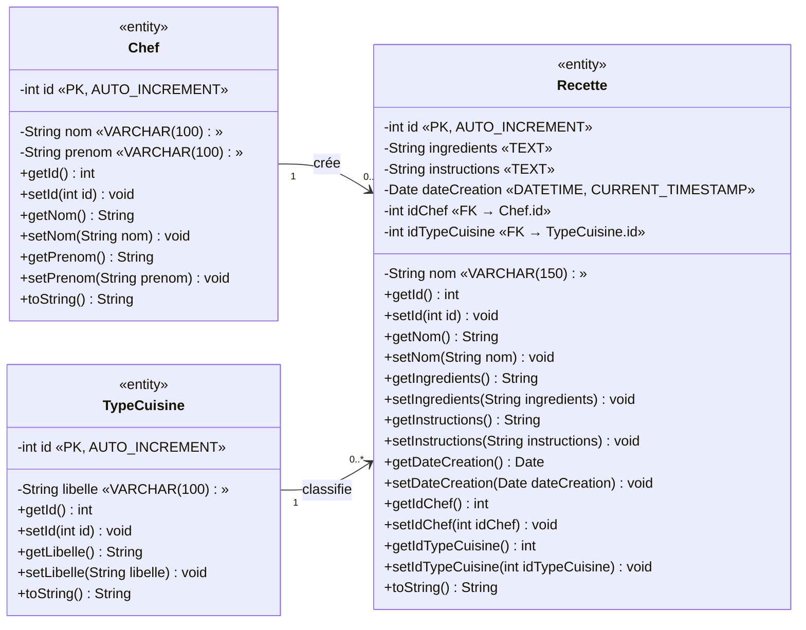

# Diagramme de classes — Gestion des recettes (avec getters/setters)

## 🔗 Diagramme de classes complet

## 📖 Convention UML utilisée

| Symbole | Signification |
|---------|---------------|
| `-` | Attribut **privé** (encapsulation) |
| `+` | Méthode **publique** |
| `«PK»` | Primary Key (clé primaire) |
| `«FK»` | Foreign Key (clé étrangère) |
| `getId()` / `setId()` | Getter / Setter (accès contrôlé aux attributs privés) |
| `toString()` | Représentation textuelle de l'objet |
| `"1" --> "0..*"` | Association 1 vers plusieurs |

## 🎯 Principe d'encapsulation

Tous les attributs sont **privés** (`-`) : ils ne sont accessibles que via les **getters** (lecture) et **setters** (écriture). Cela garantit :

- ✅ **Contrôle** : on peut valider une valeur avant de l'affecter.
- ✅ **Sécurité** : l'état interne de l'objet ne peut pas être modifié directement.
- ✅ **Évolutivité** : on peut changer l'implémentation interne sans casser le code appelant.

## 🔗 Relations

| Relation | Cardinalité | Signification |
|----------|-------------|---------------|
| `Chef → Recette` | `1 → 0..*` | Un chef peut créer 0 ou plusieurs recettes ; une recette appartient à 1 seul chef. |
| `TypeCuisine → Recette` | `1 → 0..*` | Un type de cuisine peut classer 0 ou plusieurs recettes ; une recette a 1 seul type. |