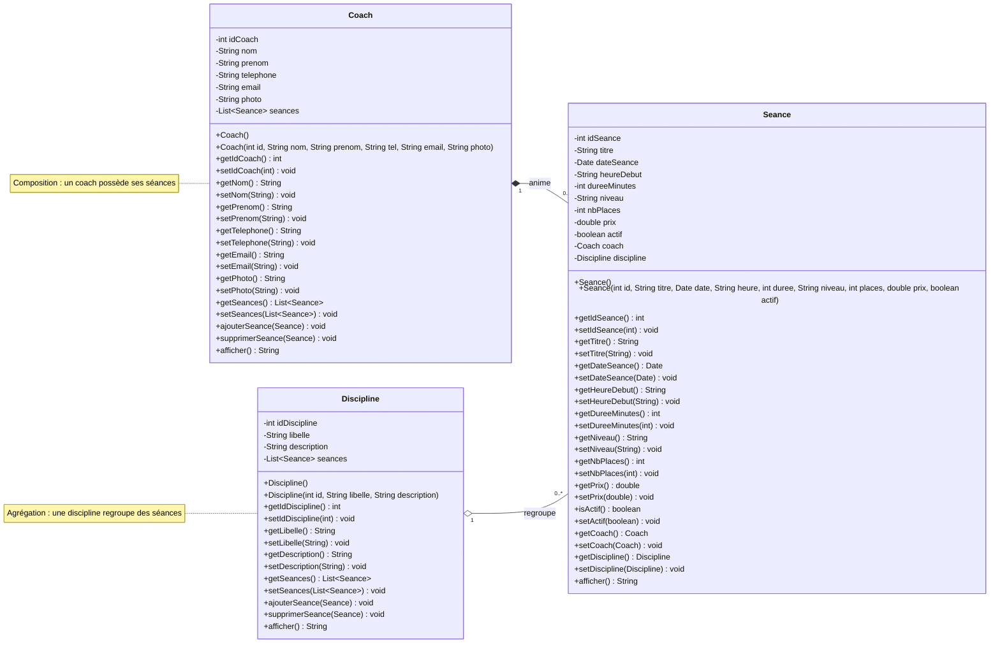

# Diagramme de classes — Système de gestion de salle de sport

```mermaid
classDiagram
    direction LR

    class Coach {
        -int idCoach
        -String nom
        -String prenom
        -String telephone
        -String email
        -String photo
        -List~Seance~ seances
        +Coach()
        +Coach(int id, String nom, String prenom, String tel, String email, String photo)
        +getIdCoach() int
        +setIdCoach(int) void
        +getNom() String
        +setNom(String) void
        +getPrenom() String
        +setPrenom(String) void
        +getTelephone() String
        +setTelephone(String) void
        +getEmail() String
        +setEmail(String) void
        +getPhoto() String
        +setPhoto(String) void
        +getSeances() List~Seance~
        +setSeances(List~Seance~) void
        +ajouterSeance(Seance) void
        +supprimerSeance(Seance) void
        +afficher() String
    }

    class Discipline {
        -int idDiscipline
        -String libelle
        -String description
        -List~Seance~ seances
        +Discipline()
        +Discipline(int id, String libelle, String description)
        +getIdDiscipline() int
        +setIdDiscipline(int) void
        +getLibelle() String
        +setLibelle(String) void
        +getDescription() String
        +setDescription(String) void
        +getSeances() List~Seance~
        +setSeances(List~Seance~) void
        +ajouterSeance(Seance) void
        +supprimerSeance(Seance) void
        +afficher() String
    }

    class Seance {
        -int idSeance
        -String titre
        -Date dateSeance
        -String heureDebut
        -int dureeMinutes
        -String niveau
        -int nbPlaces
        -double prix
        -boolean actif
        -Coach coach
        -Discipline discipline
        +Seance()
        +Seance(int id, String titre, Date date, String heure, int duree, String niveau, int places, double prix, boolean actif)
        +getIdSeance() int
        +setIdSeance(int) void
        +getTitre() String
        +setTitre(String) void
        +getDateSeance() Date
        +setDateSeance(Date) void
        +getHeureDebut() String
        +setHeureDebut(String) void
        +getDureeMinutes() int
        +setDureeMinutes(int) void
        +getNiveau() String
        +setNiveau(String) void
        +getNbPlaces() int
        +setNbPlaces(int) void
        +getPrix() double
        +setPrix(double) void
        +isActif() boolean
        +setActif(boolean) void
        +getCoach() Coach
        +setCoach(Coach) void
        +getDiscipline() Discipline
        +setDiscipline(Discipline) void
        +afficher() String
    }

    Coach "1" *-- "0..*" Seance : anime
    Discipline "1" o-- "0..*" Seance : regroupe

    note for Coach "Composition : un coach possède ses séances"
    note for Discipline "Agrégation : une discipline regroupe des séances"
```