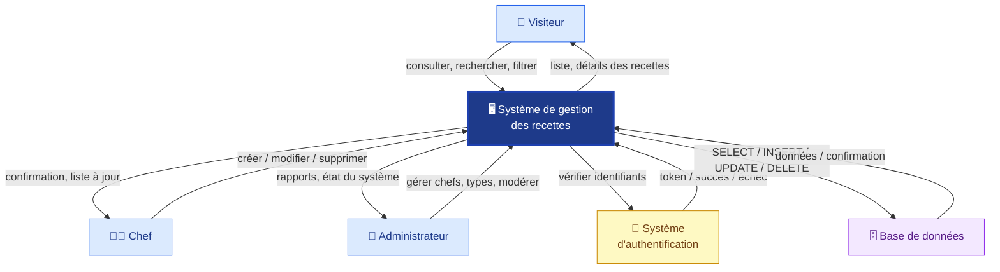

# Diagramme de contexte — Système de gestion des recettes

## Diagramme de contexte

```mermaid
graph TB
    V["👤 Visiteur"]
    C["👨‍🍳 Chef"]
    A["👑 Administrateur"]
    SYS["🖥️ Système de gestion<br/>des recettes"]
    AUTH["🔐 Système<br/>d'authentification"]
    DB["🗄️ Base de données"]

    V -->|"consulter, rechercher, filtrer"| SYS
    SYS -->|"liste, détails des recettes"| V

    C -->|"créer / modifier / supprimer"| SYS
    SYS -->|"confirmation, liste à jour"| C

    A -->|"gérer chefs, types, modérer"| SYS
    SYS -->|"rapports, état du système"| A

    SYS -->|"vérifier identifiants"| AUTH
    AUTH -->|"token / succès / échec"| SYS

    SYS -->|"SELECT / INSERT / UPDATE / DELETE"| DB
    DB -->|"données / confirmation"| SYS

    style SYS fill:#1e3a8a,stroke:#1e40af,stroke-width:3px,color:#ffffff
    style V fill:#dbeafe,stroke:#2563eb,color:#1e3a8a
    style C fill:#dbeafe,stroke:#2563eb,color:#1e3a8a
    style A fill:#dbeafe,stroke:#2563eb,color:#1e3a8a
    style AUTH fill:#fef9c3,stroke:#ca8a04,color:#713f12
    style DB fill:#f3e8ff,stroke:#9333ea,color:#581c87
```

