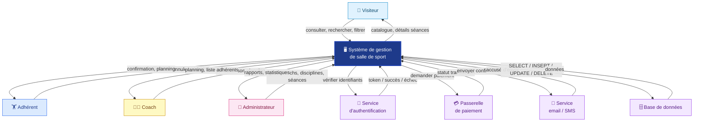

# Diagramme de contexte — Salle de sport

```mermaid
graph TB
    V["👤 Visiteur"]
    AD["🏋️ Adhérent"]
    CO["🧑‍🏫 Coach"]
    ADMIN["👑 Administrateur"]
    SYS["🖥️ Système de gestion<br/>de salle de sport"]
    AUTH["🔐 Service<br/>d'authentification"]
    PAY["💳 Passerelle<br/>de paiement"]
    MAIL["📧 Service<br/>email / SMS"]
    DB["🗄️ Base de données"]

    V -->|"consulter, rechercher, filtrer"| SYS
    SYS -->|"catalogue, détails séances"| V

    AD -->|"réserver, annuler, planning"| SYS
    SYS -->|"confirmation, planning"| AD

    CO -->|"consulter son planning"| SYS
    SYS -->|"planning, liste adhérents"| CO

    ADMIN -->|"gérer coachs, disciplines, séances"| SYS
    SYS -->|"rapports, statistiques"| ADMIN

    SYS -->|"vérifier identifiants"| AUTH
    AUTH -->|"token / succès / échec"| SYS

    SYS -->|"demander paiement"| PAY
    PAY -->|"statut transaction"| SYS

    SYS -->|"envoyer confirmation"| MAIL
    MAIL -->|"accusé d'envoi"| SYS

    SYS -->|"SELECT / INSERT / UPDATE / DELETE"| DB
    DB -->|"données"| SYS

    style SYS fill:#1e3a8a,stroke:#1e40af,stroke-width:3px,color:#ffffff
    style V fill:#e0f2fe,stroke:#0284c7,color:#0c4a6e
    style AD fill:#dbeafe,stroke:#2563eb,color:#1e3a8a
    style CO fill:#fef9c3,stroke:#ca8a04,color:#713f12
    style ADMIN fill:#fce7f3,stroke:#db2777,color:#831843
    style AUTH fill:#f3e8ff,stroke:#9333ea,color:#581c87
    style PAY fill:#f3e8ff,stroke:#9333ea,color:#581c87
    style MAIL fill:#f3e8ff,stroke:#9333ea,color:#581c87
    style DB fill:#f3e8ff,stroke:#9333ea,color:#581c87
```