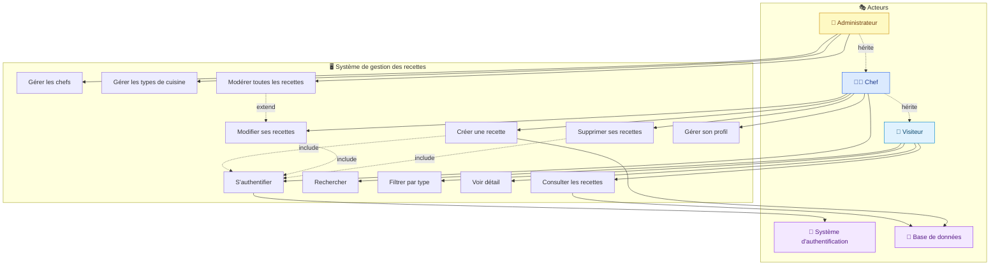

```mermaid
graph TB
    subgraph Acteurs["🎭 Acteurs"]
        V[👤 Visiteur]
        C[👨‍🍳 Chef]
        A[👑 Administrateur]
        SYS1[🔐 Système d'authentification]
        SYS2[💾 Base de données]
    end

    subgraph Système["🖥️ Système de gestion des recettes"]
        UC1["Consulter les recettes"]
        UC2["Rechercher"]
        UC3["Filtrer par type"]
        UC4["Voir détail"]
        UC5["S'authentifier"]
        UC6["Créer une recette"]
        UC7["Modifier ses recettes"]
        UC8["Supprimer ses recettes"]
        UC9["Gérer son profil"]
        UC10["Gérer les chefs"]
        UC11["Gérer les types de cuisine"]
        UC12["Modérer toutes les recettes"]
    end

    V --> UC1
    V --> UC2
    V --> UC3
    V --> UC4

    C --> UC5
    C --> UC6
    C --> UC7
    C --> UC8
    C --> UC9

    A --> UC10
    A --> UC11
    A --> UC12

    UC6 -.->|include| UC5
    UC7 -.->|include| UC5
    UC8 -.->|include| UC5
    UC12 -.->|extend| UC7

    UC5 --> SYS1
    UC1 --> SYS2
    UC6 --> SYS2

    C -.->|hérite| V
    A -.->|hérite| C

    style V fill:#e0f2fe,stroke:#0284c7,color:#0c4a6e
    style C fill:#dbeafe,stroke:#2563eb,color:#1e3a8a
    style A fill:#fef9c3,stroke:#ca8a04,color:#713f12
    style SYS1 fill:#f3e8ff,stroke:#9333ea,color:#581c87
    style SYS2 fill:#f3e8ff,stroke:#9333ea,color:#581c87
```