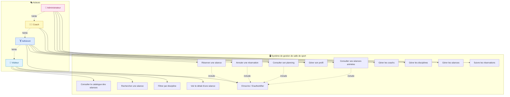

# Diagramme de cas d'utilisation — Salle de sport

## 🎭 Acteurs

| Acteur | Description |
|--------|-------------|
| 👤 **Visiteur** | Personne non connectée, consulte le catalogue |
| 🏋️ **Adhérent** | Utilisateur inscrit, réserve des séances |
| 🧑‍🏫 **Coach** | Anime les séances, consulte son planning |
| 👑 **Administrateur** | Gère coachs, disciplines et séances |

## 🔗 Diagramme

